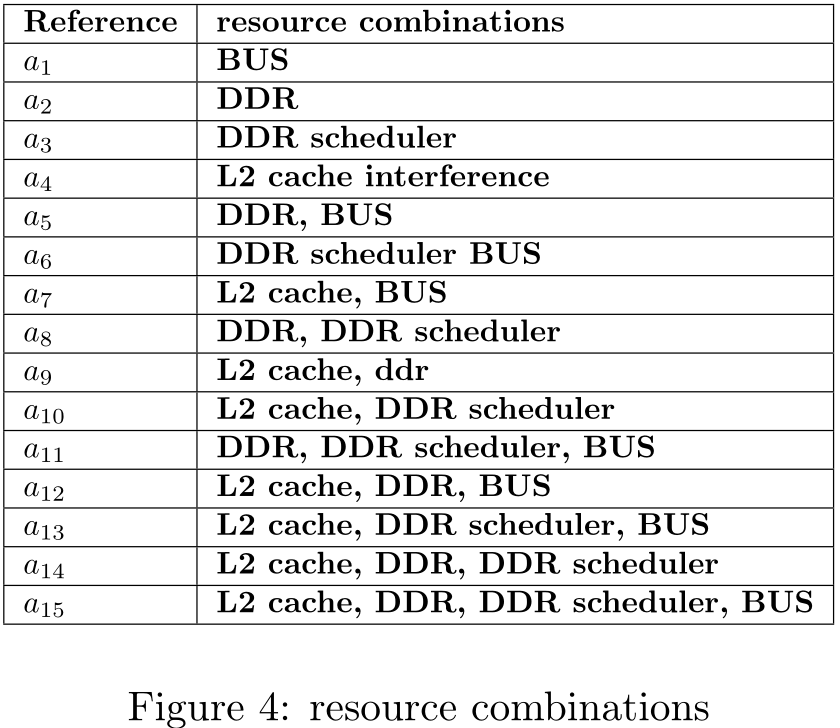
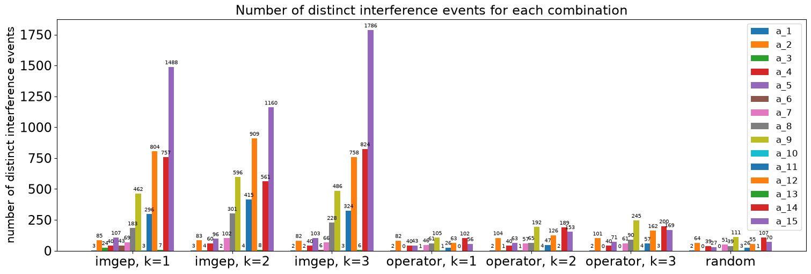
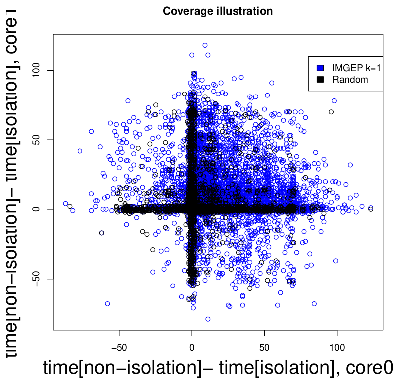
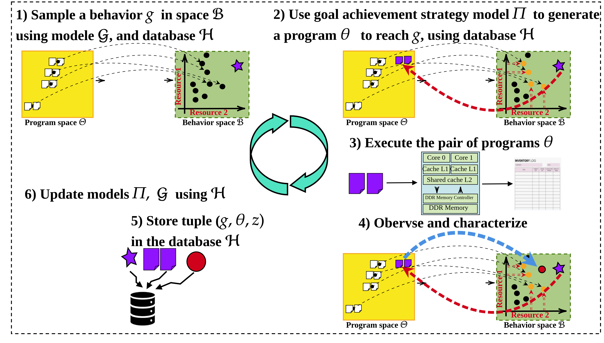
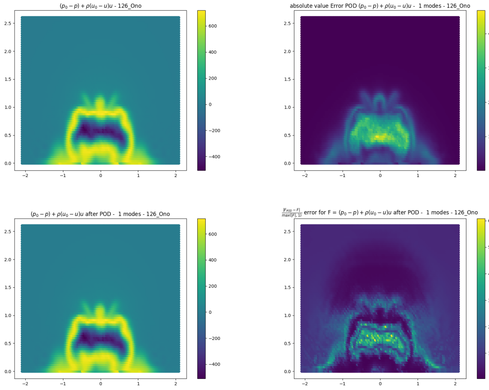
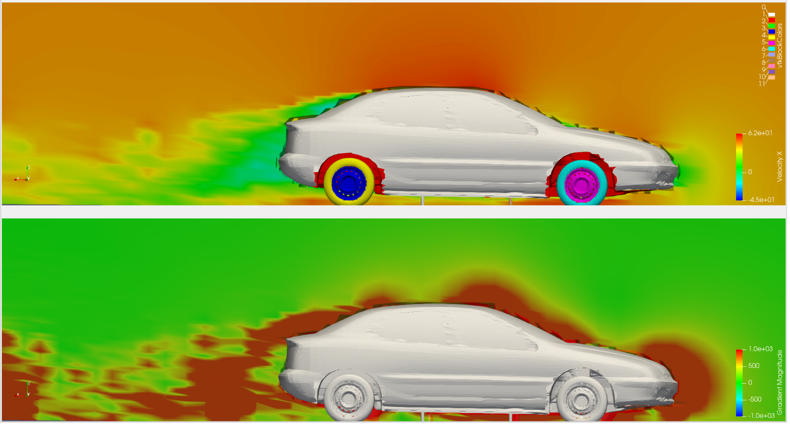

Ludovic Matar
---

Hi, I am Ludovic Matar. I aspire to work in a domain somewhere between applied mathematics and informatics that favors healthcare or climate. I graduated from a MSc in applied mathematics specialized in statistics, probability and computer science (2022). I also graduated from an MSc in fluid mechanics (2024).

I am currently working as a Research and Development Machine Learning Engineer in Flowers AI & CogSci Lab at the French National Institute for Research in Digital Science and Technology (Inria).
I am seeking for research job opportunities such as a P.h.D in applied mathematics.

Contact: [ludovic.matar@yahoo.com](mailto:ludovic.matar@yahoo.com).

# Work Experiences

## French National Institute for Research in Digital Science and Technology - R&D machine learning engineer
* From the 1st of February 2025 to the 30st of November 2026. [Flowers AI & CogSci Lab](https://www.inria.fr/en/flowers-ai-humans-curiosity-learning-cognitive-science). Inria Center at the University of Bordeaux, France
* I develop machine learning models to identify sources of interference occurring in simulated multi-core embedded architectures, using automated discovery methodology, that is, curiosity based algorithms. Ongoing methodology involves basic machine learning regressors and reinforcement learning.
* Implemented algorithms produce databases with greater diversity measures than other methods. 
* Monitoring a 6 months end-of-study internship. From the 1st of April to the 30th of September 2026.
* Previous work on arxiv: *[Application of curiosity driven exploration methods for hardware interference identification
Ludovic Matar, Clement Moulin-Frier, Pierre-Yves Oudeyer](https://arxiv.org/abs/2609.08729)*

* Description: One samples pairs of assembly programs to be executed on parallel on both core of a simulated dual-core architecture. Thereby, as some pairs of programs induce conflicts in shared resources known as interference events, an interference behavior space is being covered. For every combination of shared resources involved, there can be distinct interference events. The designed sampling distributions allow the discovery of many more distinct behaviors than random sampling distributions that remain steady during the exploration process. On the top line, the example run illustration shows that many more interference were discoverd for the ddr scheduler by "imgep, k=1" than every other sampling distribution.

 |  
   |  

 
 
 

## French Alternative Energies and Atomic Energy Commission - Research Intern
* From March to August 2024 - Laboratory of Artificial Intelligence and Data Science. Saclay, Île-de-France, France
* I developed machine learning models to characterize inherent mechanisms of heat exchange until the boiling crisis.
* Works provided research tools for the Laboratory of Modeling and Simulation in Fluid Mechanics (CEA).
* Deep learning methods (computer vision) were used on infrared videos to extract latent space systems of differential equations capturing relevant dynamics by symbolic regression approaches. I used architectures such as CNNs, RNNs combined with
autoencoders.
* [read a summary](/MatarLudovicRapportDeStageCEA.pdf){:target="_blank"}

* [read slides](/MatarLudovicPresentationStage.pdf){:target="_blank"}

* My works were used to synthesis an abstract for the 12th International Conference on Multiphase flow :
* *[Boiling phenomena analysis using machine learning. Elie Roumet, Ludovic Matar, Raksmy Nop, Geoffrey Daniel, Clément Gauchy, Nicolas Dorville, Marie-Christine Duluc](https://cea.hal.science/cea-05283483v1)*
* Description: Trajectory of a high speed shadowgraphy video in the 2D latent space of the autoencoder network

 
 

## Renault SAS - Research Intern

One visualizes the rear of a simulated flow behind a car. The adimensionned pressure field is approximated by the first mode of a Proper orthogonal decomposition.

* From May to September 2023. Guyancourt, Île-de-France, France
* Model reduction is a highly discussed topic in the industry. The research internship proposed to develop statistical methods for predicting Cx, in order to simplify calculations. It is a matter of obtaining simpler predictive algorithms, which are less time-consuming and sometimes more robust.
For a given shape modification, we want to predict the aerodynamic drag coefficient of vehicles. Drag is the force that opposes the movement of a vehicle as it moves; it is due to the friction of fluid particles in the air. The coefficient Cx is commonly used in the automotive industry for performance and consumption benefits.
My contribution was the study of dimensionality reduction techniques for obtaining a reduced space when exploiting CFD data and help to synthesis a linear algebra based solution involving optimal transport.

* [read a summary](rapport_de_stage_renault.pdf){:target="_blank"}

* [read slides](Presentation_stage_Renault.pdf){:target="_blank"}
